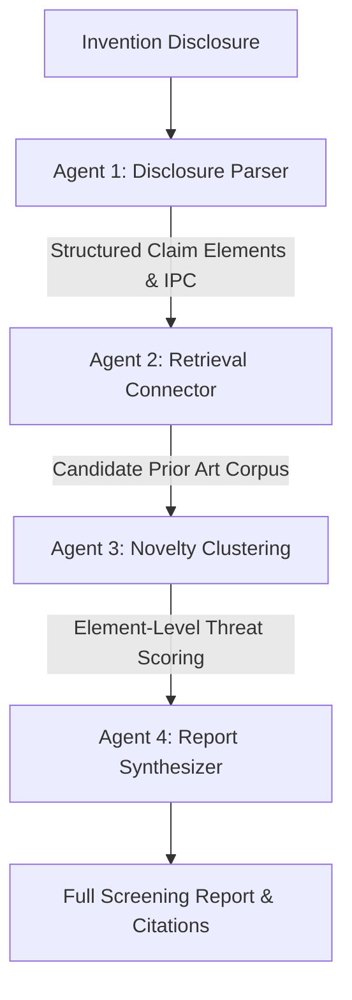

# PriorArt Copilot — Complete User & Patentability Screening Guide

---

## 1. What is PriorArt Copilot?

**PriorArt Copilot** is a multi-agent AI research workstation designed to perform preliminary patentability and prior-art screening on new technical inventions before filing with patent offices (e.g. USPTO, EPO, WIPO).

---

## 2. Understanding the 2D Threat Matrix Heatmap

The **2D Prior-Art Threat Matrix** compares each individual structural claim element of your invention against existing patents found in international databases.

### Visual Representation

```
                     Existing Patents (Prior Art Documents)
                            ┌───────────────┬──────────────┐
                            │ US-10457388-B2│ EP-3205574-A1│  ...
┌───────────────────────────┼───────────────┼──────────────┤
│ [elem_01] Rotor Hub       │     🔴 HIGH   │    🟡 MOD    │
│ [elem_02] Pushrod Actuator│     🔴 HIGH   │      ➖      │
│ [elem_03] Magnetic Sensor │     🟢 LOW    │      ➖      │
└───────────────────────────┴───────────────┴──────────────┘
▲
Your Invention's Claim Elements (Parts)
```

### Color Coding & Legal Impact

| Badge Color | Threat Level | Meaning | Patent Law Implication |
|---|---|---|---|
| 🔴 **RED** | **`HIGH`** | **Explicit Disclosure / Direct Overlap**<br>The prior-art document explicitly discloses this exact feature. | **35 U.S.C. § 102 (Lack of Novelty / Anticipation)**<br>An examiner will likely reject this element because it already exists in the public domain. |
| 🟡 **YELLOW / AMBER** | **`MOD`** | **Substantial Similarity / Functional Equivalent**<br>The patent teaches an analogous or closely related concept. | **35 U.S.C. § 103 (Obviousness / Lack of Inventive Step)**<br>Examiners may combine this patent with another reference to reject the claim. |
| 🟢 **GREEN** | **`LOW`** | **Minimal / Tangential Overlap**<br>The patent does not focus on or adequately teach this feature. | **Safe / Differentiating Feature**<br>Poses minimal threat of rejection. |
| ➖ **DASH** | **Safe** | **No relevant disclosure found in this patent.** | Clean novelty gap. |

---

## 3. Understanding Patent Identification Codes (e.g. `EP-3205574-A1`)

Every published patent in the world is assigned a unique alphanumeric registration identifier:

```
        EP       -     3205574     -     A1
     └─┬──┘           └───┬───┘         └──┬──┘
       │                  │                │
       │                  │                └─ Publication Kind Code
       │                  │                    • A1 / A2 = Published Patent Application (Pending)
       │                  │                    • B1 / B2 = Officially Granted Patent
       │                  │
       │                  └─ Serial Registration Number (Unique file number)
       │
       └─ Country / Jurisdiction Authority Code
           • US = United States Patent and Trademark Office (USPTO)
           • EP = European Patent Office (EPO)
           • WO = World Intellectual Property Organization (WIPO / PCT)
           • CN = China National Intellectual Property Administration (CNIPA)
           • JP = Japan Patent Office (JPO)
```

In PriorArt Copilot reports, all citations link directly to official publication records on **Google Patents**.

---

## 4. How to Find Your "Novelty Gap" to Win Patent Approval

1. **Identify the Green Rows**: Look for claim elements that have mostly 🟢 **LOW** or **`-`** scores across all retrieved patents.
2. **Focus Your Claims**: These green elements represent your **core technical innovation** (the "Novelty Gap").
3. **Draft Narrow, Defensible Claims**: Tie the broad elements (the red ones) specifically to the novel mechanism (the green one) in your independent claim to avoid rejection.

---

## 5. Multi-Agent Sequential Execution Pipeline

PriorArt Copilot utilizes a 4-stage sequential agent architecture:



1. **01 Disclosure Parser Agent**: Breaks down raw disclosures into discrete, testable claim elements and assigns International Patent Classifications (IPC/CPC).
2. **02 Retrieval Agent**: Expands domain-specific patent lexicons and queries patent databases.
3. **03 Novelty Clustering Agent**: Compares claim elements against prior art passages to calculate novelty threat scores.
4. **04 Report Synthesizer Agent**: Generates executive summaries, threat matrices, citation indices, and strategic claim refinement guidance.

---

## 6. UI & Theme Configuration

PriorArt Copilot includes four synchronized visual themes:
* 🟢 **Green**: Phosphor mint technical theme inspired by minimalist developer portfolios.
* ⚪ **Dark**: Obsidian slate high-contrast research theme.
* ☀️ **Light**: Clean paper research environment with high-contrast slate buttons (WCAG AAA).
* 🟡 **Amber**: Retro CRT gold theme with warm amber accents.

All themes feature a non-intrusive, hardware-accelerated animated background layer with moving technical coordinate grids, drifting luminous ambient orbs, and node constellations.
